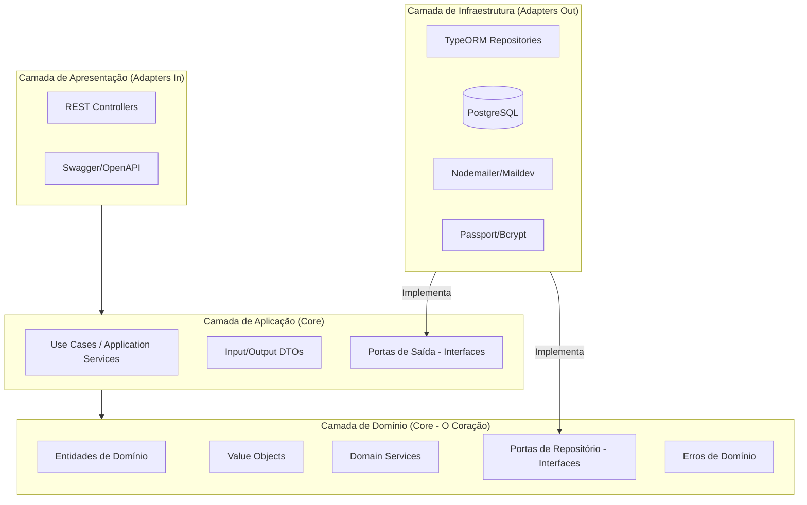

# Guia de Camadas da Arquitetura (Architecture Blueprint)

Este documento define a estrutura e as responsabilidades de cada camada do projeto **ANTISLOP**, seguindo os princípios da **Arquitetura Hexagonal (Portas e Adaptadores)** adaptados para o framework **NestJS**.

## Visão Geral

O objetivo principal é isolar a lógica de negócio (**Core**) de detalhes técnicos externos como bancos de dados, frameworks web e serviços de e-mail.

---

## 1. Camada de Domínio (`/domain`)
O ponto mais interno e isolado. Não deve ter dependências externas (exceto decorators de metadados do NestJS para Injeção de Dependência, por pragmatismo).

- **Entidades:** Classes que possuem identidade única e encapsulam regras de negócio essenciais.
- **Value Objects:** Objetos imutáveis definidos por seus atributos (ex: `Email`, `CPF`).
- **Domain Services:** Lógica que envolve múltiplas entidades e não pertence a uma entidade específica.
- **Repository Ports:** Interfaces que definem como os dados devem ser persistidos (sem citar TypeORM ou SQL).
- **Exceptions:** Erros específicos do domínio (ex: `UserAlreadyExistsException`).

## 2. Camada de Aplicação (`/application`)
Orquestra o fluxo de dados entre o Domínio e os Adaptadores Externos.

- **Use Cases:** Implementam fluxos de negócio específicos (ex: `CreateUserUseCase`).
- **DTOs (Data Transfer Objects):** Objetos simples para entrada e saída de dados.
- **Mappers:** Traduzem objetos de entrada para o Domínio e objetos do Domínio para DTOs de saída.
- **Output Ports:** Interfaces para serviços externos (ex: `IEmailService`).

## 3. Camada de Infraestrutura (`/infrastructure`)
Implementações concretas das interfaces (Ports) definidas no Domínio e na Aplicação.

- **Persistence:** Entidades do TypeORM, Migrations e implementação dos Repositórios.
- **Security:** Implementação de hashing de senhas, estratégias JWT.
- **Providers:** Implementação de serviços de e-mail, integração com APIs de terceiros.
- **Framework:** Módulos do NestJS (`*.module.ts`) que configuram a Injeção de Dependência.

## 4. Camada de Apresentação (`/presentation`)
A "borda" da aplicação que recebe estímulos externos.

- **Controllers:** Tratam requisições HTTP, validam o formato básico dos dados e chamam os Use Cases.
- **Guards/Interceptors:** Lógica de autorização e tratamento global de respostas.
- **Documentation:** Configurações de Swagger e exemplos de requisição.

---

## Regras de Ouro (Mandatários)

1.  **Direção da Dependência:** As dependências sempre apontam para dentro. O Domínio não conhece a Infraestrutura.
2.  **Inversão de Dependência:** Use Cases devem depender de **interfaces (Ports)**, nunca de classes concretas da Infraestrutura.
3.  **Isolamento de Entidades:** Entidades de Domínio **NUNCA** devem ser as mesmas entidades do TypeORM. Use Mappers para converter entre elas.
4.  **Validação:**
    - `class-validator` nos DTOs (Apresentação).
    - Regras de negócio fortes dentro do Domínio (Entidades/Services).
5.  **Tratamento de Erros:** Use Cases capturam erros de infraestrutura e os convertem em erros de aplicação/domínio compreensíveis.
