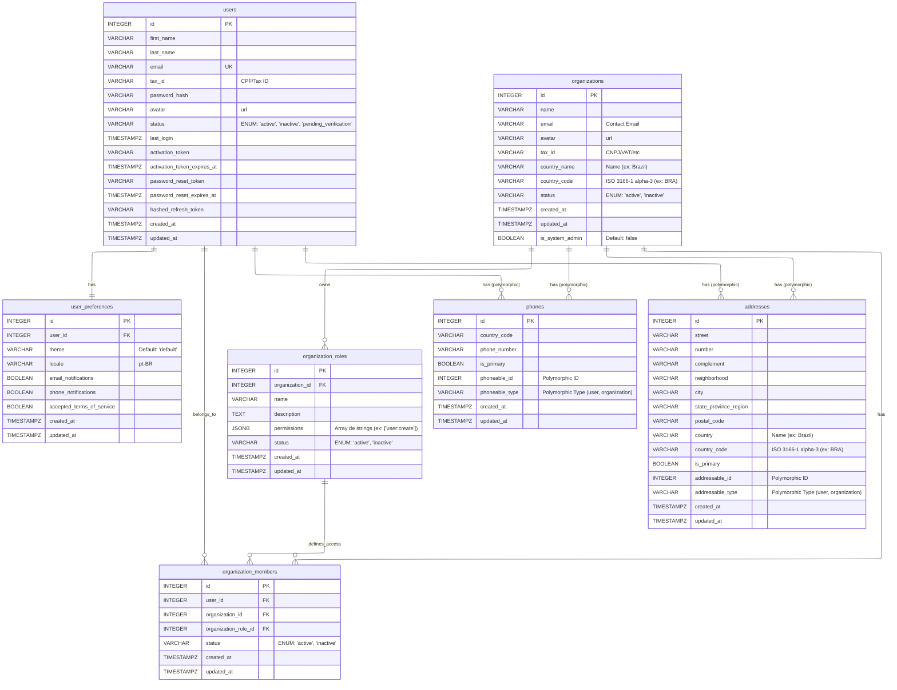

# Diagrama de Entidade-Relacionamento (ERD) - IAM (Implementado)

```mermaid
---
config:
  layout: elk
---
erDiagram
    users {
        INTEGER id PK
        VARCHAR first_name
        VARCHAR last_name
        VARCHAR email UK
        VARCHAR tax_id "CPF/Tax ID"
        VARCHAR password_hash
        VARCHAR avatar "url"
        VARCHAR status "ENUM: 'active', 'inactive', 'pending_verification'"
        TIMESTAMPZ last_login
        VARCHAR activation_token
        TIMESTAMPZ activation_token_expires_at
        VARCHAR password_reset_token
        TIMESTAMPZ password_reset_expires_at
        VARCHAR hashed_refresh_token
        TIMESTAMPZ created_at
        TIMESTAMPZ updated_at
    }

    user_preferences {
        INTEGER id PK
        INTEGER user_id FK
        VARCHAR theme "Default: 'default'"
        VARCHAR locale "pt-BR"
        BOOLEAN email_notifications
        BOOLEAN phone_notifications
        BOOLEAN accepted_terms_of_service
        TIMESTAMPZ created_at
        TIMESTAMPZ updated_at
    }

    organizations {
        INTEGER id PK
        VARCHAR name
        VARCHAR email "Contact Email"
        VARCHAR avatar "url"
        VARCHAR tax_id "CNPJ/VAT/etc"
        VARCHAR country_name "Name (ex: Brazil)"
        VARCHAR country_code "ISO 3166-1 alpha-3 (ex: BRA)"
        VARCHAR status "ENUM: 'active', 'inactive'"
        TIMESTAMPZ created_at
        TIMESTAMPZ updated_at
        BOOLEAN is_system_admin "Default: false"
    }

    organization_roles {
        INTEGER id PK
        INTEGER organization_id FK
        VARCHAR name
        TEXT description
        JSONB permissions "Array de strings (ex: ['user:create'])"
        VARCHAR status "ENUM: 'active', 'inactive'"
        TIMESTAMPZ created_at
        TIMESTAMPZ updated_at
    }

    organization_members {
        INTEGER id PK
        INTEGER user_id FK
        INTEGER organization_id FK
        INTEGER organization_role_id FK
        VARCHAR status "ENUM: 'active', 'inactive'"
        TIMESTAMPZ created_at
        TIMESTAMPZ updated_at
    }

    phones {
        INTEGER id PK
        VARCHAR country_code
        VARCHAR phone_number
        BOOLEAN is_primary
        INTEGER phoneable_id "Polymorphic ID"
        VARCHAR phoneable_type "Polymorphic Type (user, organization)"
        TIMESTAMPZ created_at
        TIMESTAMPZ updated_at
    }

    addresses {
        INTEGER id PK
        VARCHAR street
        VARCHAR number
        VARCHAR complement
        VARCHAR neighborhood
        VARCHAR city
        VARCHAR state_province_region
        VARCHAR postal_code
        VARCHAR country "Name (ex: Brazil)"
        VARCHAR country_code "ISO 3166-1 alpha-3 (ex: BRA)"
        BOOLEAN is_primary
        INTEGER addressable_id "Polymorphic ID"
        VARCHAR addressable_type "Polymorphic Type (user, organization)"
        TIMESTAMPZ created_at
        TIMESTAMPZ updated_at
    }

    %% Relacionamentos
    users ||--|| user_preferences : "has"
    users ||--o{ organization_members : "belongs_to"
    users ||--o{ phones : "has (polymorphic)"
    users ||--o{ addresses : "has (polymorphic)"

    organizations ||--o{ organization_members : "has"
    organizations ||--o{ organization_roles : "owns"
    organizations ||--o{ phones : "has (polymorphic)"
    organizations ||--o{ addresses : "has (polymorphic)"
    organization_roles ||--o{ organization_members : "defines_access"

```
